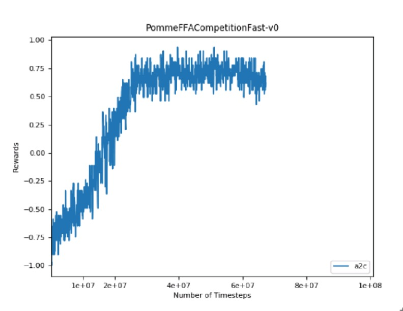

# PyTorch Pommerman

This is a PyTorch starting point for experimenting with ideas for the Pommerman competitions (https://www.pommerman.com/)

The reinforcement learning codebase is based upon Ilya Kostrikov's awesome work (https://github.com/ikostrikov/pytorch-a2c-ppo-acktr)

It requires the Pommerman `playground` (https://github.com/MultiAgentLearning/playground) to be installed in your Python environment, in addition to any dependencies of `pytorch-a2c-ppo-acktr`.

## Usage

With the spatial feature representation and CNN based models, I've been able to train an agent FFA play that does quite well (> 95% win rate). Without reward shaping, it does not learn to bomb, but it does a great job of evading and letting the other agents blow themselves up.

`python main.py --use-gae --env-name PommeFFACompetitionFast-v0 --no-norm --seed 42 --algo a2c --lr-schedule 25000000`

Below is a training curve for above command. Note that it shows the training reward (non-deterministic), not evaluation which is higher.

